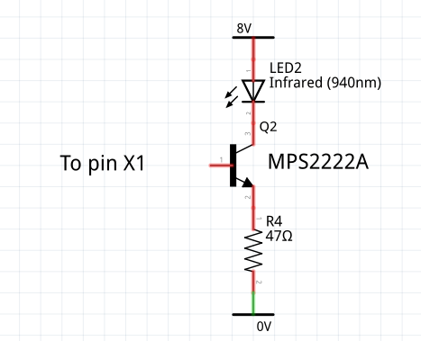
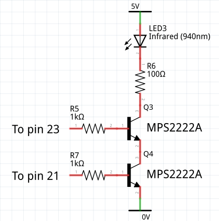

# IR Transmitter

##### [Main README](./README.md#1-ir-communication)

# 1. Hardware Requirements

The transmitter requires a Pyboard 1.x (not Lite), a Pyboard D or an ESP32.
Output is via an IR LED which needs a simple circuit to provide sufficient
current. Typically these need 50-100mA of drive to achieve reasonable range and
data integrity. A suitable 940nm LED is [this one](https://www.adafruit.com/product/387).

On the Pyboard the transmitter test script assumes pin X1 for IR output. It can
be changed, but it must support Timer 2 channel 1. Pins for pushbutton inputs
are arbitrary: X3 and X4 are used. The driver uses timers 2 and 5.

On ESP32 the demo uses pins 21 and 23 for IR output and pins 18 and 19 for
pushbuttons. These pins may be changed.

## 1.1 Pyboard Wiring

I use the following circuit which delivers just under 40mA to the diode. R2 may
be reduced for higher current.  


This alternative delivers a constant current of about 53mA if a higher voltage
than 5V is available. R4 determines the current value and may be reduced to
increase power.  


The transistor type is not critical.

The driver assumes circuits as shown. Here the carrier "off" state is 0V,
which is the driver default. If using a circuit where "off" is required to be
3.3V, the constant `_SPACE` in `ir_tx.__init__.py` should be changed to 100.

## 1.2 ESP32 Wiring

The ESP32 RMT device does not currently support the carrier option. A simple
hardware gate is required to turn the IR LED on when both the carrier pin and
the RMT pin are high. A suitable circuit is below.  


The transistor type is not critical.

# 2. Dependencies and installation

## 2.1 Dependencies

The device driver has no dependencies.

On ESP32 a firmware version >= V1.12 is required. The Loboris port is not
supported owing to the need for the RMT device.

The demo program requires `uasyncio` from the official library and `aswitch.py`
from [this repo](https://github.com/peterhinch/micropython-async).

## 2.2 Installation

The transmitter is a Python package. This minimises RAM usage: applications
only import the device driver for the protocol in use.

Copy the following to the target filesystem:
 1. `ir_tx` Directory and contents.

The demo is of a 2-button remote controller with auto-repeat. It may be run by
issuing:
```python
from ir_tx.test import test
```
Instructions will be displayed at the REPL.

# 3. The driver

This is specific to Pyboard D, Pyboard 1.x (not Lite) and ESP32.

It implements a class for each supported protocol, namely `NEC`, `SONY_12`,
`SONY_15`, `SONY_20`, `RC5` and `RC6_M0`.  Each class is subclassed from a
common abstract base class in `__init__.py`. The application instantiates the
appropriate class and calls the `transmit` method to send data.

#### Common to all classes

Constructor args:  
 1. `pin` A Pin instance instantiated as an output. On a Pyboard this is a
 `pyb.Pin` instance supporting Timer 2 channel 1: `X1` is employed by the test
 script. On ESP32 any `machine.Pin` may be used. Must be connected to the IR
 diode as described below.
 2. `freq=default` The carrier frequency in Hz. The default for NEC is 38000,
 Sony is 40000 and Philips is 36000.
 3. `verbose=False` If `True` emits (a lot of) debug output.

Method:
 1. `transmit(addr, data, toggle=0)` Integer args. `addr` and `data` are
 normally 8-bit values and `toggle` is normally 0 or 1; details are protocol
 dependent and are described below.

The `transmit` method is synchronous with rapid return. Actual transmission
occurs as a background process, on the Pyboard controlled by timers 2 and 5.
Execution times on a Pyboard 1.1 were 3.3ms for NEC, 1.5ms for RC5 and 2ms
for RC6.

#### NEC class

This has an additional method `.repeat` (no args). This causes a repeat code to
be transmitted. Should be called every 108ms if a button is held down.

The NEC protocol accepts 8 or 16 bit addresses. In the former case, a 16 bit
value is transmitted comprising the 8 bit address and its one's complement,
enabling the receiver to perform a simple error check. The `NEC` class supports
these modes by checking the value of `addr` passed to `.transmit` and sending
the complement for values < 256.

A value passed in `toggle` is ignored.

#### Sony classes

The SIRC protocol supports three sizes, supported by the following classes:
 1. 12 bit (7 data, 5 address) `SONY_12`
 2. 15 bit (7 data, 8 address) `SONY_15`
 3. 20 bit (7 data, 5 addresss, 8 extended) `SONY_20`

The `.transmit` method masks `addr` and `data` values to the widths listed
above. `toggle` is ignored except by `SONY_20` which treats it as the extended
value.

#### Philips classes

The RC-5 protocol supports a 5 bit address and 6 or 7 bit (RC5X) data. The
driver uses the appropriate mode depending on the `data` value provided.

The RC-6 protocol accepts 8 bit address and data values.

Both send a `toggle` bit which remains constant if a button is held down, but
changes when the button is released. The application should implement this
behaviour, setting the `toggle` arg of `.transmit` to 0 or 1 as required.

# 4. Principle of operation

## 4.1 Pyboard

The classes inherit from the abstract base class `IR`. This has an array `.arr`
to contain the duration (in μs) of each carrier on or off period. The
`transmit` method calls a `tx` method of the subclass which populates this
array. This is done by two methods of the base class, `.append` and `.add`. The
former takes a list of times (in ) and appends them to the array. A bound
variable `.carrier` keeps track of the notional on/off state of the carrier:
this is required for bi-phase (manchester) codings.

The `.add` method takes a single μs time value and adds it to the last value
in the array: this pulse lengthening is used in bi-phase encodings.

On completion of the subclass `.tx`, `.transmit` appends a special `STOP` value
and initiates physical transmission which occurs in an interrupt context.

This is performed by two hardware timers initiated in the constructor. Timer 2,
channel 1 is used to configure the output pin as a PWM channel. Its frequency
is set in the constructor. The OOK is performed by dynamically changing the
duty ratio using the timer channel's `pulse_width_percent` method: this varies
the pulse width from 0 to a duty ratio passed to the constructor. The NEC
protocol defaults to 50%, the Sony and Philips ones to 30%.

The duty ratio is changed by the Timer 5 callback `._cb`. This retrieves the
next duration from the array. If it is not `STOP` it toggles the duty cycle
and re-initialises T5 for the new duration.

## 4.2 ESP32

The carrier is output continuously at the specified duty ratio. A pulse train
generated by the RMT instance drives a hardware gate such that the IR LED is
lit only when both carrier and RMT are high.

The carrier is generated by PWM instance `.pwm` running continuously. The ABC
constructor converts the 0-100 duty ratio specified by the subclass to the
0-1023 range used by ESP32.

# 5. References

[General information about IR](https://www.sbprojects.net/knowledge/ir/)

The NEC protocol:  
[altium](http://techdocs.altium.com/display/FPGA/NEC+Infrared+Transmission+Protocol)  
[circuitvalley](http://www.circuitvalley.com/2013/09/nec-protocol-ir-infrared-remote-control.html)

Philips protocols:  
[RC5](https://en.wikipedia.org/wiki/RC-5)  
[RC5](https://www.sbprojects.net/knowledge/ir/rc5.php)  
[RC6](https://www.sbprojects.net/knowledge/ir/rc6.php)

Sony protocol:  
[SIRC](https://www.sbprojects.net/knowledge/ir/sirc.php)
